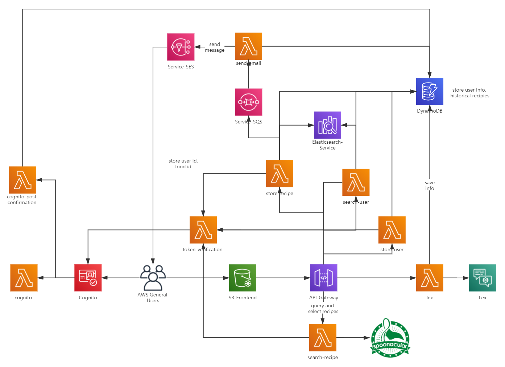

# COMS_6998_Final_Project

## Introduction
Foodle is a web application for recipe searching and intake monitoring. Based on users' body conditions and taste preference, this app will display various matching dishes with nutrition information and cooking instructions.

## Architecture

